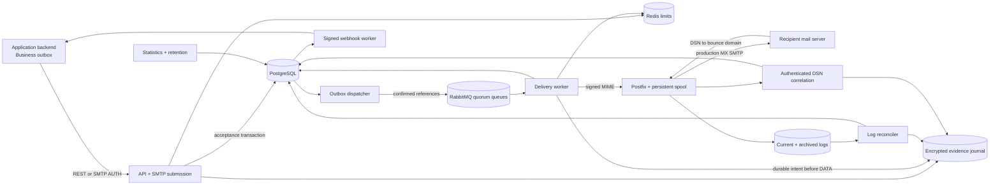
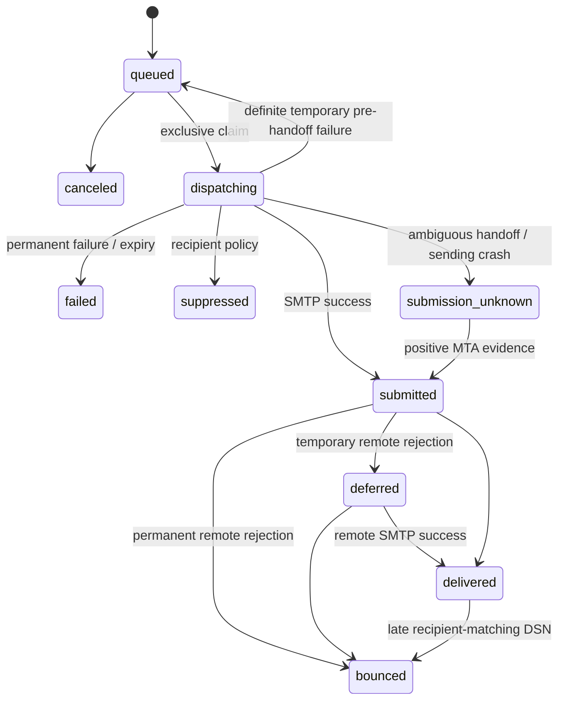

# Architecture

selfmail is a transactional mail subsystem with an asynchronous delivery boundary. PostgreSQL owns application state; Postfix owns mail after a confirmed SMTP handoff. RabbitMQ transports references to work, and Redis enforces rate policy.

The supplied deployment is a **single Linux host**. Processes can restart independently. The local file locks and shared control/journal volumes require one filesystem with working POSIX locks and durable writes. This topology is not a multi-host HA cluster.

## Components and flow

| Process | Responsibility |
|---|---|
| `api` | HTTP authentication, authorization, validation, templates, durable acceptance; SMTP AUTH/STARTTLS submission |
| `dispatcher` | Publish due outbox references with mandatory routing and publisher confirms |
| `worker` | Claim a message, enforce policy, build/sign MIME, fence an attempt, hand off to Postfix |
| `reconciler` | Read current/rotated/compressed Postfix logs with persistent cursors and evidence |
| `bounce` | Validate signed return-path attempt tokens and apply recipient-matching DSNs |
| `webhooks` | Sign and deliver events; retry, disable corrupt endpoints, expose dead-job repair |
| `maintainer` | Aggregate counters from deltas and drain bounded retention passes |
| `initialize` / `migrate` | Initialize identity/key guard and apply versioned/checksummed migrations |

One binary selects the process by subcommand. Separate containers allow independent resource limits and restart behavior without duplicating implementation.

## Code boundaries

| Directory | Role |
|---|---|
| `internal/domain` | Requests, message/event types, statuses, validation |
| `internal/application` | Business policy, bounded templates, work budget |
| `internal/store` | PostgreSQL transactions, RLS, claims, outbox, retention, reconciliation |
| `internal/broker`, `internal/limiter` | RabbitMQ and Redis adapters |
| `internal/mailmsg`, `internal/mta` | MIME, DKIM, SMTP, log/DSN adapters |
| `internal/journal`, `internal/recovery` | Durable independent evidence, filesystem fences, recovery identity |
| `internal/httpapi`, `internal/submission` | Public protocol adapters |
| `internal/worker`, `internal/telemetry` | Process loops and metrics |
| `pkg/client` | Reusable Go client and webhook verification |
| `cmd` | Runtime CLI and development-only verification/drill tools |

Application/worker dependencies are interfaces, enabling transport and failure tests. SQL invariants and OS durability are tested through their real adapters rather than replaced with mocks everywhere.

## Data ownership

- **Tenant:** name, pause state, sending rate, daily limit, retained payload usage.
- **API key:** tenant identity, scopes, digest, revocation. The caller stores the plaintext key.
- **Domain:** per-tenant DNS ownership token, unique DKIM selector, public key, encrypted private key.
- **Batch:** normalized-request fingerprint, key digest, cached original response, retention tombstone. Identity is `UNIQUE(tenant_id, idempotency_digest)`.
- **Payload:** one shared body/raw MIME/attachment payload per batch, even when it has several recipients.
- **Message:** one recipient, priority, scheduling/expiry, status, active attempt, Postfix queue identity.
- **Attempt:** immutable attempt ID plus preparing/sending/accepted/unknown phase, node and queue correlation.
- **Outbox:** reference published after the same transaction that creates the message.
- **Event / webhook job:** monotonic event sequence, stable event ID, endpoint delivery status.
- **MTA receipt/cursor:** node + queue correlation, file identity and logical byte offsets.
- **Statistics deltas:** asynchronously aggregated into 32 counter shards.

Tenant reads/writes use a transaction-local identity and PostgreSQL RLS. API and worker roles have different privileges. Workers and admin CLI are trusted infrastructure with broader access; they are not public tenant interfaces.

## Acceptance and idempotency

1. Authenticate the key; check scope, pause state, domain and recipient policy.
2. Acquire the shared ingress work permit before decoding/rendering large data.
3. Normalize/validate the request, compute the fingerprint, and replay an existing matching key if present.
4. Validate the full encoded MIME budget, including a bounded DKIM reserve.
5. In one tenant transaction, lock quota/pause state, reauthorize the key, check payload/backlog/daily limits, and insert batch, payload, messages, events, and outbox references.
6. Persist the encrypted acceptance intent; commit SQL; persist its independent committed marker before reporting success.

Concurrent copies of the same operation return the original IDs. A changed payload under the same key returns conflict. Template selection happens on first acceptance, so updating a template does not change an already accepted retry.

A network error is not proof of rejection. Retrying the original key can repair a missing acceptance-commit marker when SQL proves commit. A worker verifies that marker before claiming a batch. The default tombstone retention is at least 90 days while active work remains protected; cleanup completion controls when a key can be reused.

## Queue behavior

RabbitMQ uses durable quorum queues for `critical`, `normal`, and `bulk`, with persistent reference messages, publisher confirms, mandatory routing, manual acknowledgements, bounded queue length, and a dead-letter queue. `WORKER_CONCURRENCY` is the consumer count **per priority**, while a separate shared budget limits expensive MIME work to four jobs per worker process.

The outbox row is marked published only after a routing/confirm success. A crash after a broker confirm but before SQL commit can produce a duplicate reference. Workers claim through PostgreSQL; redelivery does not authorize another SMTP attempt. Expired preparing leases are recovered. Ready messages with no pending/recent published outbox reference are republished by the watchdog.

The shipped broker has one node. A quorum queue on one node supplies durability but does not provide node-loss HA. The dead-letter queue requires operational inspection; it has no automatic purge and its disk use must be included in sizing.

## Delivery state

Cancellation applies to `queued`. `ttl_seconds` expires the job before beginning MTA submission; it cannot recall mail already accepted by Postfix. Postfix then applies its own queue lifetime and retry policy.

### Sending fence

Claims have a two-minute preparing lease. `MarkSending` locks tenant policy, then the message, then its active attempt. It reads the phase **after acquiring locks** and uses `clock_timestamp()` for lease/TTL checks before and after journal durability. PostgreSQL `now()` reflects transaction start, so it is not used to validate time elapsed while waiting on these locks. [PostgreSQL time-function reference](https://www.postgresql.org/docs/18/functions-datetime.html#FUNCTIONS-DATETIME-CURRENT).

The durable intent is written before committing the sending phase, and the phase commits before network SMTP I/O. SQL locks are not held throughout delivery. A stale worker cannot hand off a recovered preparing attempt; a sending/unknown attempt cannot be automatically reclaimed for a new SMTP copy.

Suppression/pause is rechecked at the fence. Key revocation is checked on every accepted SMTP DATA operation, and the enqueue transaction locks the key authorization record against concurrent revocation. Jobs committed before revocation remain independent accepted work.

### Postfix ownership

A successful final SMTP response transfers ownership to Postfix. It persists its spool, retries temporary destination failures, and does not ask the application to resend `submitted` or `deferred` messages.

The SMTP transport distinguishes a definite pre-commit rejection from a lost/ambiguous DATA response. An ambiguity is recorded as `submission_unknown`; positive queue/delivery evidence can resolve it. A missing log line is not proof that Postfix rejected the message.

Each application message has one envelope recipient. `smtp_destination_recipient_limit=50` makes destination scheduling domain-based, with concurrency 5 and a 1-second destination delay; setting this parameter to 1 would change grouping to recipient-based. The application/domain Redis limits provide an additional policy layer. [Postfix parameter reference](https://www.postfix.org/postconf.5.html#smtp_destination_recipient_limit).

## Log and DSN evidence

The reconciler identifies files using node identity, inode metadata, and initial-content identity; offsets are logical uncompressed byte positions. SQL cursor advancement and evidence application are transactional. Archive CRC/integrity is checked before applying a compressed file. An unread or corrupt archive is not silently treated as complete.

Rotation preserves old files until full ingestion is marked. Compression waits for the completed cursor and a quiet interval. Expiry protects unread files; current settings retain archives for at least 90 days. Queue activation or delivery evidence, rather than a cleanup header alone, proves MTA ownership.

Return paths encode attempt identity with a secret-derived authenticator. DSN recipient identity must match the attempt before a status or suppression changes. These checks establish correlation; a DSN remains data from the mail ecosystem and is not an absolute proof of human receipt.

## Webhooks

Events use stable UUIDs and per-message monotonic sequences. Delivery is at least once and can arrive out of order. Signatures cover timestamp plus original JSON bytes. Receivers deduplicate event IDs in the same transaction as their business action.

Network/retriable HTTP failures receive bounded retries with jitter; twelve attempts exhaust a job. A corrupt endpoint secret or permanent endpoint-policy failure disables the endpoint and moves its pending jobs to dead status so neighbors continue. Repair, bounded replay, and dead-job resolution are explicit audited CLI operations. Replays retain the original event identity.

## Recovery and retention

The independent journal stores correlation and delivery evidence, **not message bodies or attachments**. Record files are encrypted and immutable, and a hash-chained manifest is checked against a sealed head in a separate control volume. Missing/truncated evidence, incorrect keys, mismatched instance identity, or interrupted pending writes fail closed.

A recovery hold lives outside SQL, blocks new acceptance/claims, and waits for existing delivery permits. Reconciliation restores accepted IDs, blocks uncertain attempts, applies stronger MTA outcomes, and records a digest tied to the current recovery generation. Release checks that digest and preserves unresolved unknown work.

Retention records independent retirement markers before deleting final eligible SQL metadata or idempotency tombstones. It locks children and rechecks eligibility after waits. Replay honors those markers by exact BatchID: it cannot resurrect expired metadata or overwrite a later operation that reused the key. The legacy plaintext-key unique constraint was removed; digest identity is authoritative.

SQL cleanup uses bounded passes and quickly schedules continuation while work remains. Journal evidence is append-only in this version; there is **no automatic compaction**. Capacity limits stop new acceptance before silently discarding recovery evidence. See [recovery](recovery.md) and [resources](resources.md).

## Delivery guarantees

| Boundary | Guarantee and limit |
|---|---|
| Application business transaction | Requires the application's own outbox to connect order/account changes to a mail request |
| HTTP `202` / submission `250` | Durable accepted job and independent acceptance evidence; recoverability depends on retained SQL/evidence backups |
| Broker delivery | At least once; duplicate references are expected and guarded by SQL claims |
| Worker → Postfix | Confirmed handoff transfers ownership; ambiguity stays blocked until reconciliation/operator action |
| Postfix → remote MX | Remote success or retry/bounce according to SMTP; remote queues can also experience ambiguity |
| `delivered` | SMTP server acceptance, without an inbox-placement/read guarantee |
| Managed SQL/PITR restore | Journal reconciliation prevents blind resending when current independent evidence is preserved |
| Whole-host loss | Recovery is limited by independent backup freshness, retained keys/evidence, and a validated restore procedure |

Unmanaged replacement of PostgreSQL with an old snapshot cannot be reliably inferred by the application. Use the documented hold/restore/reconcile protocol. OS-volume loss, multi-node failover, public delivery reputation, and remote RPO/RTO require validation on the chosen infrastructure.
