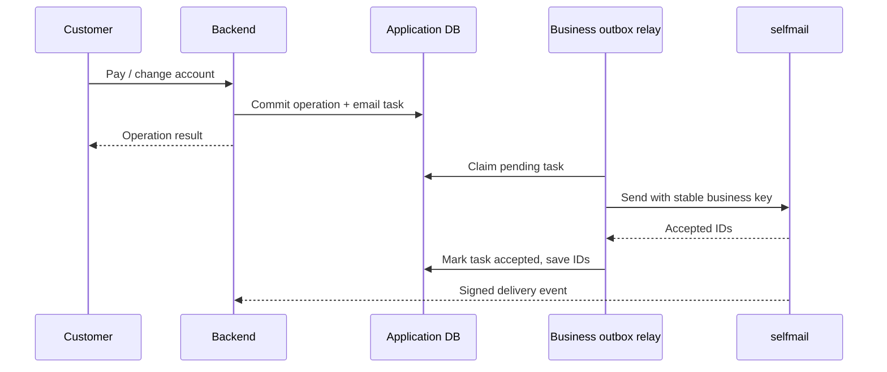

# Integrating an application

Treat selfmail as an internal network service. Keep its key in your backend secrets, commit mail tasks alongside business changes, and deliver them asynchronously. The same contract works for a coffee shop, jewelry store, and later projects.

## Tenants and keys

```sh
docker compose exec worker selfmail tenant create \
  --name coffee --domain coffee.example.test --rate 10 --daily-limit 10000
docker compose exec worker selfmail tenant create \
  --name jewelry --domain jewelry.example.test --rate 10 --daily-limit 10000
docker compose exec worker selfmail key issue \
  --tenant TENANT_UUID --scopes messages:write,messages:read
```

The create command shows the tenant UUID, a new secret key, and domain details. Store the secret immediately; it is not retrieved later. Use the narrow send/read key in the application; keep domain/template/webhook administration credentials with operators.

| Scope | Capability |
|---|---|
| `messages:write` | Accept mail and cancel queued work |
| `messages:read` | Read statuses, lists, and events |
| `domains:write` | Create/read/verify sender domains |
| `templates:write` | Create immutable template versions |
| `suppressions:write` | Add/remove per-project suppressions |
| `webhooks:write` | Create/disable webhook endpoints |

Scopes do not make the admin CLI a public API. It runs with a trusted infrastructure role. Revocation uses `selfmail key revoke --token KEY`; avoid shell-history/process exposure when executing this administrative command. Revocation blocks new acceptance, including subsequent DATA in a previously authenticated SMTP connection. Existing accepted mail is handled through its own status/policy.

Projects may use the same From domain, but each tenant must publish its own DNS ownership proof and unique DKIM selector. Subdomains such as `accounts.coffee.example.org` and `orders.shop.example.org` make ownership and reputation policy easier to manage.

## REST acceptance

```sh
curl https://mail-api.your-domain.tld/v1/messages \
  -H 'Authorization: Bearer YOUR_KEY' \
  -H 'Content-Type: application/json' \
  -H 'Idempotency-Key: coffee:receipt:order-42:v1' \
  -d '{
    "from":"receipts@coffee.your-domain.tld",
    "from_name":"Coffee Shop",
    "to":["buyer@example.net"],
    "subject":"Your receipt",
    "text":"Thank you for your purchase. Your receipt is attached.",
    "html":"<p>Thank you for your purchase.</p>",
    "priority":"normal",
    "attachments":[{"filename":"receipt.pdf","content_type":"application/pdf","data":"BASE64_PDF_BYTES"}],
    "metadata":{"order_id":"42"}
  }'
```

New acceptance returns `202`:

```json
{"batch_id":"UUID","message_ids":["UUID"],"replayed":false}
```

A matching retry returns `200` with the original IDs and `replayed:true`. One message is created per recipient; the body is shared within the batch. Suppression, quota, and authorization failures reject the batch before commit.

Use a deterministic business key such as `receipt:ORDER_ID:VERSION` or a persisted UUID such as `password-reset:REQUEST_UUID`. A timeout can happen after commit: retry **the same normalized request and key**. Changed content under the key returns `409`. Do not produce a fresh random key on every network retry. The default tombstone horizon is at least 90 days, extended while protected work remains; after cleanup expires it, reuse is a new operation.

## Priority, timing, and limits

| Field/limit | Contract |
|---|---|
| `priority` | `critical` for short-lived security links, `normal` for receipts, `bulk` for larger technical notification streams |
| `send_at` | RFC3339 timestamp, scheduling no more than 30 days ahead |
| `ttl_seconds` | 30–86400 seconds from scheduled acceptance time; default 86400; expiry before MTA handoff |
| HTTP JSON | Maximum 8 MiB |
| Decoded body + attachments/raw MIME | Maximum 5 MiB |
| Recipients / attachments | 1–100 recipients / at most 10 attachments |
| Subject / display name | Maximum 998 / 200 UTF-8 bytes |
| Filename / content type | Maximum 255 UTF-8 bytes each; filename excludes path separators/control characters |
| Signed MIME | `MAX_WIRE_BYTES`, default 10 MiB; final validation also enforces SMTP line length |
| Variables | JSON only, 256 KiB encoded budget, bounded depth/node/iteration/work limits |
| Metadata | At most 20 keys, 64-byte keys and 256-byte values |

Byte limits count UTF-8 octets, not characters. Subjects and bodies support UTF-8. SMTP envelope addresses are ASCII; IDN domains must be punycode. SMTPUTF8 local parts are unsupported. Attachments are supplied as base64 bytes, not fetched from arbitrary URLs.

Once Postfix accepts a job, its queue retry policy applies even if an application token expires. The application's password-reset endpoint must enforce the token's own expiry and single-use semantics.

## HTTP errors and reads

| Code | Client action |
|---|---|
| `400` | Fix JSON, unknown fields, malformed/oversized request |
| `401` | Supply a valid credential |
| `403` | Check scope, tenant pause, sender authorization |
| `404` | Resource absent or belongs to another tenant |
| `409` | Resolve changed idempotent request or invalid state transition |
| `410` | Message metadata has expired; a retained batch tombstone still exists |
| `422` | Fix validation, quota, or suppression policy |
| `503` | Temporary resource/dependency/recovery fence; honor `Retry-After` when provided and use the same key |
| `500` | Unexpected server failure; preserve the original operation when retrying |

`GET /v1/messages/{id}` returns current status. `GET /v1/messages?limit=50&before=CURSOR` lists up to 100 messages; use `next_cursor`. `GET /v1/messages/{id}/events?limit=1000&cursor=CURSOR` provides keyset pagination by monotonic sequence; keep paging until `next_cursor` is empty. Appends do not invalidate prior sequence cursors.

`POST /v1/messages/{id}/cancel` cancels queued work; it cannot recall a message from Postfix. The complete route/scope/schema definitions are in [OpenAPI](../api/openapi.yaml).

## Go SDK

Add `github.com/Elmar006/selfmail/pkg/client` to your Go module using a reviewed commit/tag. Go 1.26 is required by this repository's module.

```go
mailer, err := client.New(baseURL, apiKey)
if err != nil { return err }
ctx, cancel := context.WithTimeout(context.Background(), 20*time.Second)
defer cancel()

result, err := mailer.Send(ctx, "receipt:"+orderID+":v1", client.SendRequest{
    From: "receipts@coffee.your-domain.tld", To: []string{buyerEmail},
    Subject: "Your receipt", Text: "Thank you for your purchase.",
    Attachments: []client.Attachment{{Filename: "receipt.pdf", ContentType: "application/pdf", Data: pdfBytes}},
})
if err != nil { return err }
status, err := mailer.Status(ctx, result.MessageIDs[0])
```

The SDK rejects URL credentials/query/fragment, does not follow redirects, and does not create hidden retries or keys. `*client.APIError` exposes HTTP status and `RetryAfter`. `Send` waits for acceptance, not delivery. `Events`, `List`, `Cancel`, and `VerifyWebhook` are also available.

## SMTP submission

Development: `localhost:1587`, username tenant UUID (or `apikey`), password API key. Production: your mail hostname, port `587`, mandatory STARTTLS with certificate validation, then AUTH PLAIN. Session lifetime is limited; each DATA acceptance rechecks the key.

```js
import nodemailer from "nodemailer";

const mailer = nodemailer.createTransport({
  host: "mail.your-domain.tld", port: 587,
  secure: false, requireTLS: true,
  auth: { user: process.env.MAIL_TENANT_ID, pass: process.env.MAIL_API_KEY }
});
await mailer.sendMail({
  from: "receipts@coffee.your-domain.tld", to: buyerEmail,
  subject: "Your receipt", text: "Thank you for your purchase.",
  messageId: `<receipt-${orderID}-${receiptVersion}@coffee.your-domain.tld>`,
  attachments: [{ filename: "receipt.pdf", content: pdfBytes }]
});
```

`secure:false` selects STARTTLS rather than implicit TLS; `requireTLS:true` requires the upgrade. [Nodemailer SMTP reference](https://nodemailer.com/smtp).

Python can use `smtplib.SMTP`, `starttls(context=ssl.create_default_context())`, and `login`. Other standard SMTP libraries work with the same contract. The Header From must match MAIL FROM and use an authorized domain. Caller-controlled routing/authentication headers are sanitized.

SMTP `250` after DATA confirms accepted work. Exact deduplication requires retrying identical original MIME bytes and Message-ID. Some mail libraries regenerate Date/boundaries on retry; for an explicit business idempotency key and returned IDs, use REST. Long raw headers are folded where legal; unbreakable oversized headers or raw SMTP lines are rejected before acceptance.

## Templates

```sh
curl -X PUT https://mail-api.your-domain.tld/v1/templates/receipt \
  -H "Authorization: Bearer $SELFMAIL_TEMPLATE_KEY" \
  -H 'Content-Type: application/json' \
  -d '{"subject":"Order {{.OrderID}}","text":"Total: {{.Total}}","html":"<p>Total: {{.Total}}</p>"}'
```

Then send with `template:"receipt"` and `variables:{"OrderID":"42","Total":"1 500 ₽"}`. Body fields cannot be combined with a template. Versions are immutable and selected during first acceptance. HTML is escaped by `html/template`.

Rendering has a 500 ms execution budget, operation/iteration limits, and context cancellation, including empty nested ranges. Only JSON values and an allowed function set are accepted. `printf`, `call`, recursive template invocation, and arbitrary Go methods are unsupported; preformat currency/dates in the backend. This constrained contract is intentional.

## Domains and suppressions

Create a production domain with `POST /v1/domains`, publish its ownership TXT and selector's DKIM TXT, then call `POST /v1/domains/{name}/verify`. Verification checks the exact ownership token and public key. [Operations](operations.md) covers SPF, alignment, bounce routing, and TLS.

Add suppression with `POST /v1/suppressions` and remove through `DELETE /v1/suppressions/{recipient}` after an operator verifies the address. Hard address failures can add per-tenant suppression automatically. A recipient suppressed for one tenant does not suppress unrelated projects.

## Signed webhooks

`POST /v1/webhooks` accepts an HTTPS endpoint and returns a shared secret once. Production blocks private/reserved targets and redirects. Subscribe your backend to events created after endpoint activation.

Headers: `X-Selfmail-Event-ID`, `X-Selfmail-Timestamp`, `X-Selfmail-Signature: v1=HEX_HMAC`. Verify the **original raw body** before JSON decoding:

```go
err := client.VerifyWebhook([]byte(secret),
    r.Header.Get("X-Selfmail-Timestamp"),
    r.Header.Get("X-Selfmail-Signature"), rawBody,
    time.Now(), 5*time.Minute)
if err != nil { /* reject */ }
```

Deduplicate event IDs and commit the business effect in one receiver transaction before returning `2xx`. Delivery may be repeated or out of order; compare sequence/current status. A late DSN can update a previously delivered message to bounced. Backfill past state through the paginated API rather than expecting a new endpoint to receive all history.

## Application outbox and same-server deployment



If the relay crashes after acceptance but before saving IDs, it repeats the same key and receives the original IDs. This closes the business-to-mail gap without placing SMTP inside the order transaction. Generate receipt PDFs in the purchase/fiscalization subsystem and attach their bytes.

On one server, call `http://127.0.0.1:18080` from a host backend, or connect an application container to a deliberately shared Docker network and give the API a stable alias. Keep mail storage separate from application data. A Docker `core` network is private to its Compose project; another stack does not discover `api` automatically. For separate hosts, use HTTPS and restricted ingress. Domains and tenants are logical ownership boundaries, not a requirement for one VPS per project.
